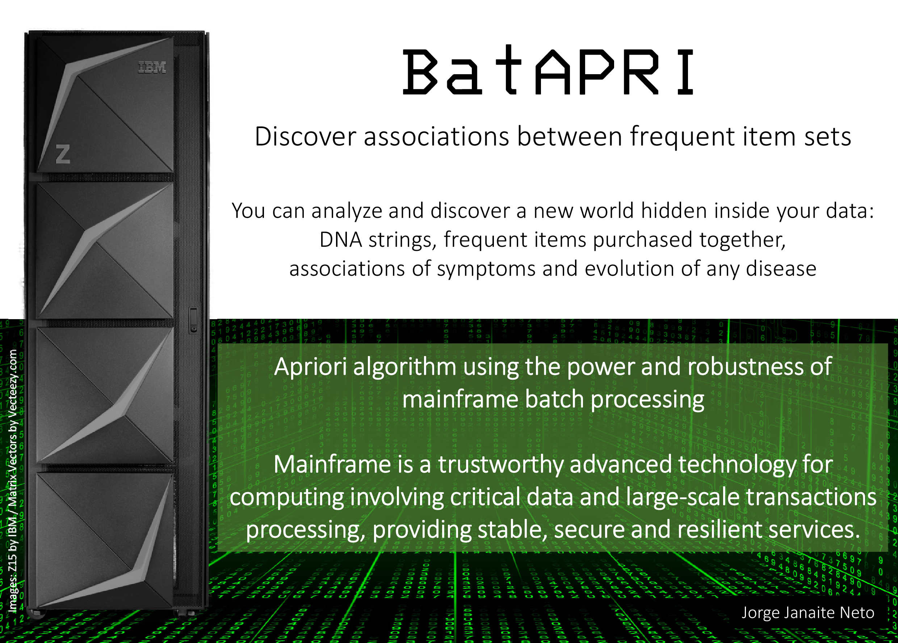
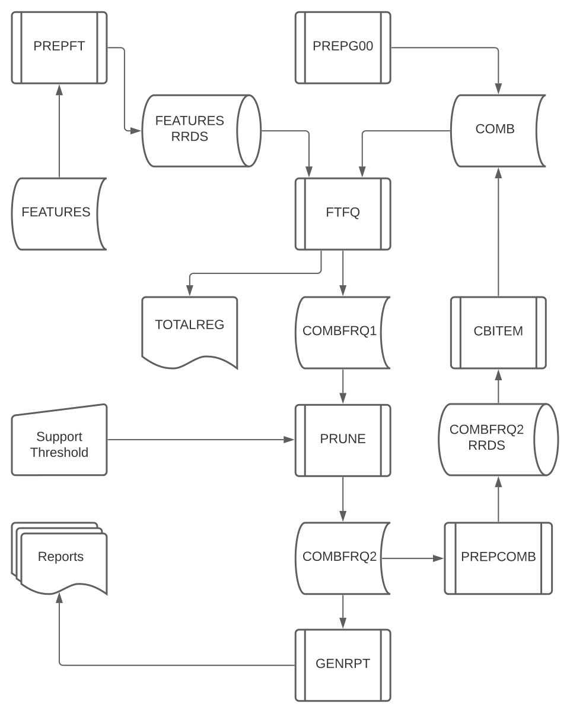

# BatAPRI
Discover associations between frequent item sets

* Uses [Apriori algorithm](https://en.wikipedia.org/wiki/Apriori_algorithm)
* Implemented in COBOL 
* Runs on z/OS
* **This software was created for IBM Master The Mainframe 2020**

(2021-01-17)

# Flyer

# Diagram

# Datasets
_Entry point_: Z08362.MTM20.JCL(MAIN)

* INPUT
  * Z08362.MTM20.INPUT.FEATURES

* OUTPUT
  * Z08362.MTM20.OUTPUT.REPORT

* TEMPORARY DATA
  * Z08362.MTM20.DATA.COMB
  * Z08362.MTM20.DATA.COMBFRQ1
  * Z08362.MTM20.DATA.COMBFRQ2
  * Z08362.MTM20.DATA.COMBRRD

* COBOL code
  * Z08362.MTM2020.cbl(CBITEM)
  * Z08362.MTM2020.cbl(FTFREQ)
  * Z08362.MTM2020.cbl(GEN1)

* JCL
  * Z08362.MTM2020.JCL(CBITEM)
  * Z08362.MTM2020.JCL(FTFREQ)
  * Z08362.MTM2020.JCL(GEN1)
  * Z08362.MTM2020.JCL(MAIN)

* JCLLIB
  * Z08362.MTM2020.JCLLIB(CMBITEM)
  * Z08362.MTM2020.JCLLIB(FTFQ)
  * Z08362.MTM2020.JCLLIB(FTFQ0)
  * Z08362.MTM2020.JCLLIB(GENRPT)
  * Z08362.MTM2020.JCLLIB(NEWFT)
  * Z08362.MTM2020.JCLLIB(PREPCOMB)
  * Z08362.MTM2020.JCLLIB(PREPFT)
  * Z08362.MTM2020.JCLLIB(PREPG00)
  * Z08362.MTM2020.JCLLIB(PRUNE)
  * Z08362.MTM2020.JCLLIB(RMPROC)